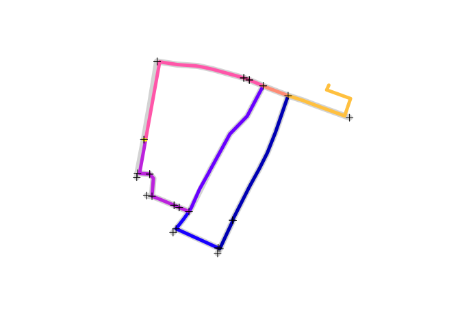
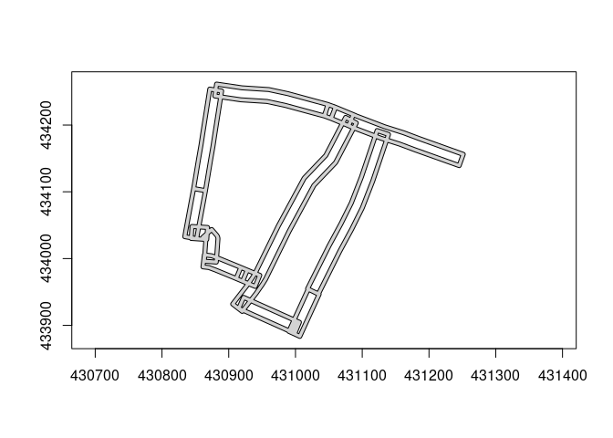
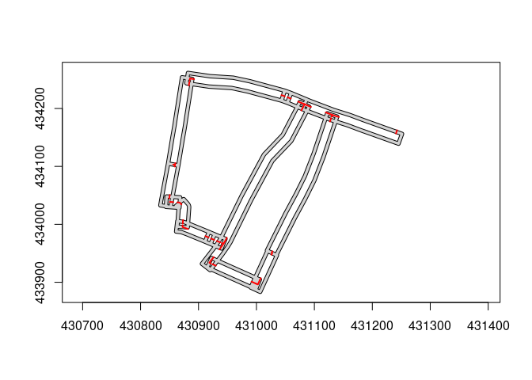
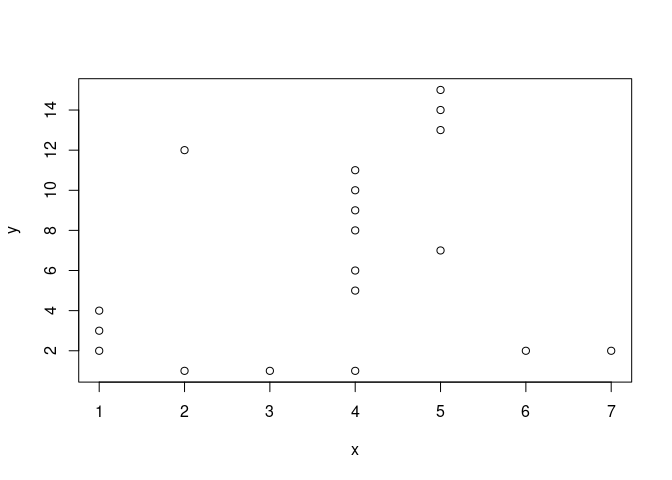
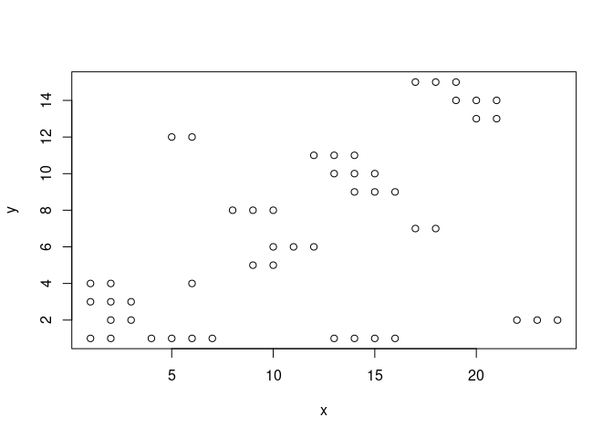
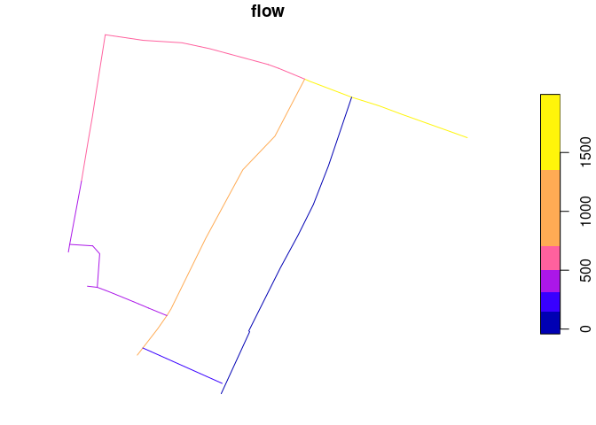
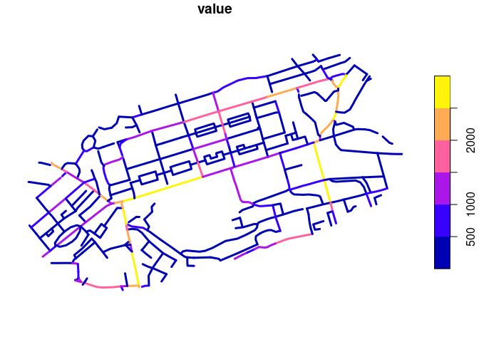
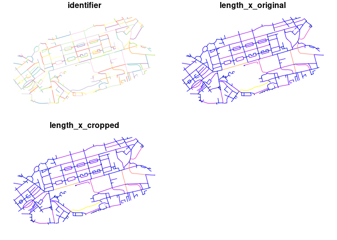
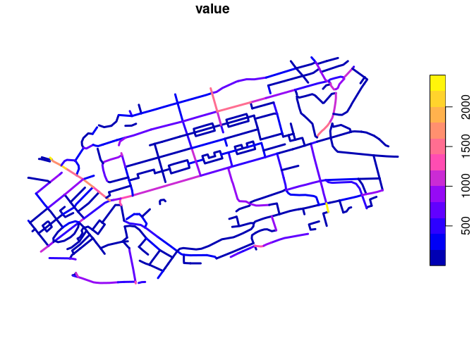

# Demonstration of matching route networks


``` r
library(stplanr)
library(sf)
```

    Linking to GEOS 3.11.1, GDAL 3.6.4, PROJ 9.1.1; sf_use_s2() is TRUE

``` r
rnet_y = route_network_small["flow"]
rnet_y$id = 1:nrow(rnet_y)
# The target object
rnet_x = rnet_subset(osm_net_example[1], rnet_y)
```

    Warning: attribute variables are assumed to be spatially constant throughout
    all geometries

    Warning in st_cast.sf(sf::st_cast(x, "MULTILINESTRING"), "LINESTRING"):
    repeating attributes for all sub-geometries for which they may not be constant

    Joining with `by = join_by(osm_id)`

``` r
# Get start and end points for each linestring in rnet_x:
rnet_x_s = lwgeom::st_startpoint(rnet_x)
rnet_x_e = lwgeom::st_endpoint(rnet_x)
plot(rnet_x$geometry, lwd = 9, col = "lightgrey")
plot(rnet_y["flow"], add = TRUE, lwd = 5)
plot(rnet_x_s, add = TRUE, pch = 3)
plot(rnet_x_e, add = TRUE, pch = 3)
```



The stplanr solution was as follows:

``` r
rnet_y$quietness <- rnorm(nrow(rnet_y))
funs <- list(flow = sum, quietness = mean)
rnet_merged <- rnet_merge(rnet_x[1], rnet_y[c("flow", "quietness")],
  dist = 9, segment_length = 20, funs = funs
)
```

    Warning in line_segment_rsgeo(l, n_segments = n_segments): The CRS of the input object is latlon.
    This may cause problems with the rsgeo implementation of line_segment().

    Joining with `by = join_by(osm_id)`

``` r
plot(rnet_y$geometry, lwd = 5, col = "lightgrey")
plot(rnet_merged["flow"], add = TRUE, lwd = 2)
```


Note that this leaves gaps in the network. Also, the join syntax is a
bit clunky.

Let’s try doing the same thing but with `geos`. First we’ll reproject
the data.

``` r
rnet_x_projected = st_transform(rnet_x, "EPSG:27700")
rnet_y_projected = st_transform(rnet_y, "EPSG:27700")
```

Then we’ll convert to `geos` objects.

``` r
rnet_x_geos = geos::as_geos_geometry(rnet_x_projected)
rnet_y_geos = geos::as_geos_geometry(rnet_y_projected)
```

We’ll create a buffer around `rnet_x`:

``` r
params = geos::geos_buffer_params(end_cap_style = "flat")
rnet_x_buffer = geos::geos_buffer(rnet_x_geos, 9, params = params)
plot(rnet_x_buffer)
plot(rnet_y_geos, add = TRUE, col = "red", lwd = 2)
```


Now let’s ‘chop’ the source geometry into segments that fit within the
buffer:

``` r
# Convert to linestring:
rnet_xbl = geos::geos_boundary(rnet_x_buffer)
rnet_xblb = geos::geos_buffer(rnet_xbl, 3, params = params)
rnet_xlbc = geos::geos_make_collection(rnet_xblb)
rnet_xlbcu = geos::geos_unary_union(rnet_xlbc)
rnet_y_remove = geos::geos_intersection(
  rnet_y_geos,
  rnet_xlbcu
)
plot(rnet_xlbcu, col = "lightgrey")
```



``` r
plot(rnet_xlbcu, col = "lightgrey")
plot(rnet_y_remove, add = TRUE, col = "red", lwd = 2)
```


The red bits are the parts of the source geometry `rnet_y` that we
*don’t* want. Let’s get the bits that we *do* want:

``` r
rnet_y_chopped = geos::geos_difference(
  rnet_y_geos,
  rnet_xlbcu
)
plot(rnet_xlbcu)
plot(rnet_x_buffer, add = TRUE, col = "lightgrey", border = NA)
plot(rnet_y_chopped, add = TRUE, col = "red", lwd = 2)
```



<!-- For every 'chopped' linestring there is at least one matching linestring in `rnet_y`.
Let's find them as follows: -->
<!-- That shows that we're not quite ready to join the data: we need to exclude the red bits that are outside the original buffer. -->

``` r
rnet_ycl = geos::geos_unnest(rnet_y_chopped, keep_multi = FALSE)
rnet_ycj = geos::geos_inner_join_keys(
  rnet_ycl,
  rnet_y_geos
)
plot(rnet_ycj)
```


We can also join `rnet_y_chopped` and `rnet_ycl` to `rnet_x_buffer` to
get the buffer geometry:

``` r
rnet_ycj = geos::geos_inner_join_keys(
  rnet_y_chopped,
  rnet_x_buffer
)
nrow(rnet_ycj)
```

    [1] 19

``` r
length(rnet_y_chopped)
```

    [1] 8

``` r
length(unique(rnet_ycj$x))
```

    [1] 7

``` r
length(unique(rnet_ycj$y))
```

    [1] 15

``` r
plot(rnet_ycj)
```



``` r
rnet_y
```

    Simple feature collection with 8 features and 3 fields
    Geometry type: LINESTRING
    Dimension:     XY
    Bounding box:  xmin: -1.533105 ymin: 53.80045 xmax: -1.526994 ymax: 53.80365
    Geodetic CRS:  WGS 84
       flow                       geometry id  quietness
    1   128 LINESTRING (-1.530829 53.80...  1 -0.2539483
    2   162 LINESTRING (-1.531674 53.80...  2  0.3856504
    3   244 LINESTRING (-1.531674 53.80...  3  2.0103106
    5   466 LINESTRING (-1.53293 53.802...  4  0.2697152
    6   540 LINESTRING (-1.53293 53.802...  5 -4.2020236
    8   784 LINESTRING (-1.529524 53.80...  6 -0.7291357
    9   912 LINESTRING (-1.528802 53.80...  7 -0.3584004
    10 1006 LINESTRING (-1.532978 53.80...  8  0.7269805

``` r
rnet_yclj = geos::geos_inner_join_keys(
  rnet_ycl,
  rnet_x_buffer
)
nrow(rnet_yclj)
```

    [1] 50

``` r
length(rnet_ycl)
```

    [1] 25

``` r
plot(rnet_yclj)
```



``` r
rnet_y
```

    Simple feature collection with 8 features and 3 fields
    Geometry type: LINESTRING
    Dimension:     XY
    Bounding box:  xmin: -1.533105 ymin: 53.80045 xmax: -1.526994 ymax: 53.80365
    Geodetic CRS:  WGS 84
       flow                       geometry id  quietness
    1   128 LINESTRING (-1.530829 53.80...  1 -0.2539483
    2   162 LINESTRING (-1.531674 53.80...  2  0.3856504
    3   244 LINESTRING (-1.531674 53.80...  3  2.0103106
    5   466 LINESTRING (-1.53293 53.802...  4  0.2697152
    6   540 LINESTRING (-1.53293 53.802...  5 -4.2020236
    8   784 LINESTRING (-1.529524 53.80...  6 -0.7291357
    9   912 LINESTRING (-1.528802 53.80...  7 -0.3584004
    10 1006 LINESTRING (-1.532978 53.80...  8  0.7269805

``` r
rnet_ycj2 = geos::geos_inner_join_keys(
  rnet_y_geos,
  rnet_x_buffer
)
waldo::compare(rnet_ycj, rnet_ycj2)
```

    `attr(old, 'row.names')`: 1 3 4 5 7 8 10 11 12 13 and 22 more...
    `attr(new, 'row.names')`: 1 2 3 5 6 7  8 11 12 14            ...

    old vs new
                x  y
    - old[1, ]  1  4
    + new[1, ]  1 12
    - old[2, ]  1  3
    + new[2, ]  1 16
    - old[3, ]  1  2
    + new[3, ]  1  4
    - old[4, ]  2 12
    + new[4, ]  1  3
    - old[5, ]  2  1
    + new[5, ]  1  2
    - old[6, ]  3  1
    + new[6, ]  2 12
    - old[7, ]  4  9
    + new[7, ]  2  9
    - old[8, ]  4 10
    + new[8, ]  2  4
    - old[9, ]  4 11
    + new[9, ]  2  1
    - old[10, ] 4  6
    + new[10, ] 3  1
    and 22 more ...

     `old$x[1:9]`: 1 1 1       2 2   3 and 5 more...
    `new$x[1:15]`: 1 1 1 1 1 2 2 2 2 3           ...

    `old$x[15:19]`: 5 5 5           6 7 and 2 more...
    `new$x[21:32]`: 5 5 5 5 5 5 6 6 6 7           ...

    `old$y`:  4  3 2 12 1  1 9 10 11 6 and 22 more...
    `new$y`: 12 16 4  3 2 12 9  4  1 1            ...

Now let’s join the dataframe versions:

``` r
rnet_y_df = sf::st_drop_geometry(rnet_y)
rnet_y_df_expanded = rnet_y_df[rnet_ycj$x, ]
rnet_x_df = sf::st_drop_geometry(rnet_x)
rnet_x_df_expanded = rnet_x_df[rnet_ycj$y, ]
rnet_y_df_expanded$osm_id = rnet_x_df_expanded$osm_id
nrow(rnet_y_df_expanded)
```

    [1] 19

``` r
nrow(rnet_x)
```

    [1] 16

``` r
rnet_x_agg = rnet_y_df_expanded |>
  dplyr::group_by(osm_id) |>
  dplyr::summarise(
    flow = sum(flow),
    quietness = mean(quietness)
  )
rnet_x_joined = dplyr::left_join(
    rnet_x,
    rnet_x_agg,
)
```

    Joining with `by = join_by(osm_id)`

``` r
plot(rnet_x_joined["flow"])
```


Let’s compare the old and new joined flows:

``` r
# place plots side by side
par(mfrow = c(1, 2))
plot(rnet_y$geometry, lwd = 5, col = "lightgrey")
plot(rnet_merged["flow"], add = TRUE, lwd = 2)

plot(rnet_y$geometry, lwd = 5, col = "lightgrey")
plot(rnet_x_joined["flow"], add = TRUE, lwd = 2)
```



``` r
par(mfrow = c(1, 1))
```

To package this up we used the following commands:

``` r
usethis::use_description()
usethis::use_package("geos")
```

We created a function that takes `rnet_x` and `rnet_y` and returns a
dataframe with the joined data:

``` r
rnet_x = rnet_x_projected
rnet_y = rnet_y_projected
distance = 9
dist_chop = 0.1
rnet_join = function(
    rnet_x,
    rnet_y,
    distance = 9,
    dist_chop = 0.1
    ) {
  # Check CRS is projected:
  stopifnot(
    sf::st_is_longlat(rnet_x) == FALSE,
    sf::st_is_longlat(rnet_y) == FALSE
  )
  rnet_x_geos = geos::as_geos_geometry(rnet_x)
  rnet_y_geos = geos::as_geos_geometry(rnet_y)
  params = geos::geos_buffer_params(end_cap_style = "flat")
  rnet_x_buffer = geos::geos_buffer(rnet_x_geos, distance, params = params)
  rnet_xbl = geos::geos_boundary(rnet_x_buffer)
  rnet_xblb = geos::geos_buffer(rnet_xbl, dist_chop, params = params)
  rnet_xlbc = geos::geos_make_collection(rnet_xblb)
  rnet_xlbcu = geos::geos_unary_union(rnet_xlbc)
  rnet_y_chopped = geos::geos_difference(
    rnet_y_geos,
    rnet_xlbcu
  )
  rnet_ycj = geos::geos_inner_join_keys(
    rnet_y_chopped,
    rnet_x_buffer
  )
  rnet_y_df = sf::st_drop_geometry(rnet_y)
  rnet_y_df_expanded = rnet_y_df[rnet_ycj$x, ]
  rnet_y_df_expanded$id_x = rnet_x_df[[1]][rnet_ycj$y]
  # Replace 'id_x' with the name of the first column in rnet_x_df:
  nx = which(names(rnet_y_df_expanded) == "id_x")
  new_name = names(rnet_x_df)[1]
  names(rnet_y_df_expanded)[nx] = new_name
  rnet_y_df_expanded
}
# Test it:
res = rnet_join(rnet_x, rnet_y)
res
```

        flow id  quietness    osm_id
    1    128  1 -0.2539483 619241249
    1.1  128  1 -0.2539483  34359804
    1.2  128  1 -0.2539483  25024600
    1.3  128  1 -0.2539483  23120679
    2    162  2  0.3856504 169555938
    2.1  162  2  0.3856504 145796711
    2.2  162  2  0.3856504  34359804
    2.3  162  2  0.3856504   6072857
    3    244  3  2.0103106   6072857
    3.1  244  3  2.0103106 169591262
    5    466  4  0.2697152 145796711
    5.1  466  4  0.2697152 162489416
    5.2  466  4  0.2697152 162489422
    5.3  466  4  0.2697152  34423763
    5.4  466  4  0.2697152  34423636
    5.5  466  4  0.2697152  53014870
    5.6  466  4  0.2697152   6072857
    6    540  5 -4.2020236  38422455
    6.1  540  5 -4.2020236   6072857
    6.2  540  5 -4.2020236 169591262
    6.3  540  5 -4.2020236 169591263
    6.4  540  5 -4.2020236 440408598
    8    784  6 -0.7291357  23120679
    9    912  7 -0.3584004  23120679

``` r
res |>
  dplyr::group_by(id) |>
  dplyr::summarise(
    osm_ids = paste(osm_id, collapse = ", ")
  )
```

    # A tibble: 7 × 2
         id osm_ids                                                               
      <int> <chr>                                                                 
    1     1 619241249, 34359804, 25024600, 23120679                               
    2     2 169555938, 145796711, 34359804, 6072857                               
    3     3 6072857, 169591262                                                    
    4     4 145796711, 162489416, 162489422, 34423763, 34423636, 53014870, 6072857
    5     5 38422455, 6072857, 169591262, 169591263, 440408598                    
    6     6 23120679                                                              
    7     7 23120679                                                              

# Benchmark

Let’s test it on a larger dataset:

``` r
rnet_x = sf::read_sf("https://github.com/ropensci/stplanr/releases/download/v1.0.2/rnet_x_ed.geojson")
rnet_y = sf::read_sf("https://github.com/ropensci/stplanr/releases/download/v1.0.2/rnet_y_ed.geojson")
```

``` r
plot(rnet_y["value"], lwd = 5)
```


``` r
plot(rnet_x$geometry, lwd = 9, col = "lightgrey")
plot(rnet_y["value"], add = TRUE, lwd = 5)
plot(rnet_x_s, add = TRUE, pch = 3)
plot(rnet_x_e, add = TRUE, pch = 3)
```


Let’s compare the `stplanr` implementation with the new implementation:

``` r
# Stplanr implementation:
system.time({
rnet_merged = rnet_merge(rnet_x, rnet_y["value"], dist = 9, segment_length = 20, funs = list(value = sum))
})
```

    Warning in line_segment_rsgeo(l, n_segments = n_segments): The CRS of the input object is latlon.
    This may cause problems with the rsgeo implementation of line_segment().

    Joining with `by = join_by(identifier)`

       user  system elapsed 
      0.125   0.004   0.127 

``` r
plot(rnet_merged["value"], lwd = 3)
```


``` r
devtools::load_all()
```

    ℹ Loading rnetmatch

``` r
rnet_xp = rnet_x |>
  sf::st_transform("EPSG:27700")
rnet_yp = rnet_y |>
  sf::st_transform("EPSG:27700") 
system.time({
rnet_matched = rnet_match(rnet_xp, rnet_yp, distance = 9, dist_chop = 1)
rnet_matched_agg = rnet_matched |>
  dplyr::group_by(identifier) |>
  dplyr::summarise(value = sum(value))
rnet_joined = rnet_x |>
  dplyr::left_join(rnet_matched_agg)
})
```

    Joining with `by = join_by(identifier)`

       user  system elapsed 
      2.679   0.005   2.684 

``` r
summary(rnet_joined)
```

      identifier        length_x_original  length_x_cropped            geometry  
     Length:474         Min.   :  0.1014   Min.   :  0.1014   LINESTRING   :474  
     Class :character   1st Qu.: 36.4612   1st Qu.: 31.3322   epsg:4326    :  0  
     Mode  :character   Median : 60.4061   Median : 52.8589   +proj=long...:  0  
                        Mean   : 78.7435   Mean   : 73.5093                      
                        3rd Qu.:107.2705   3rd Qu.: 97.5270                      
                        Max.   :507.1724   Max.   :507.1724                      
                                                                                 
         value      
     Min.   :    0  
     1st Qu.:  169  
     Median :  598  
     Mean   : 1511  
     3rd Qu.: 2059  
     Max.   :13067  
     NA's   :45     

``` r
# rnet_joined$value
plot(rnet_joined["value"], lwd = 3)
```



# With rsgeo

``` r
remotes::install_github("josiahparry/rsgeo", ref = "rent")
```

    Using github PAT from envvar GITHUB_PAT

    Skipping install of 'rsgeo' from a github remote, the SHA1 (3f132b44) has not changed since last install.
      Use `force = TRUE` to force installation

``` r
rnet_x = sf::read_sf("https://github.com/ropensci/stplanr/releases/download/v1.0.2/rnet_x_ed.geojson") |> 
  sf::st_transform(27700)
rnet_y = sf::read_sf("https://github.com/ropensci/stplanr/releases/download/v1.0.2/rnet_y_ed.geojson") |> 
  sf::st_transform(27700)

plot(rnet_x)
```



``` r
library(rsgeo)


x <- as_rsgeo(rnet_x)
y <- as_rsgeo(rnet_y)


# 3rd arg is distance 4th is slope tolerance
# distance is in units of the input data
system.time({
res <- rsgeo:::rnet_merge(x, y, 20, 0.2)  

excluded <- setdiff(1:length(x), res$from)

from <- rnet_x[res$from,]
to <- lapply(res$to, \(.i) rnet_y[.i,])
to_mean_value <- sapply(res$to, \(.i) mean(rnet_y$value[.i]))

rnet_matched_rsgeo = dplyr::bind_cols(from, value = to_mean_value)
})
```

       user  system elapsed 
      0.122   0.000   0.122 

``` r
plot(rnet_matched_rsgeo["value"], lwd = 3)
```



Let’s try matching the data:
