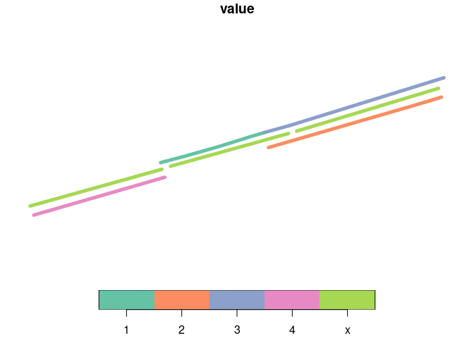
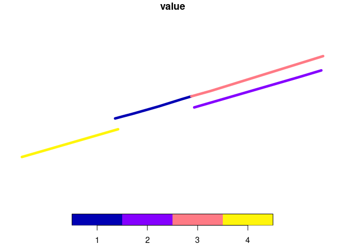
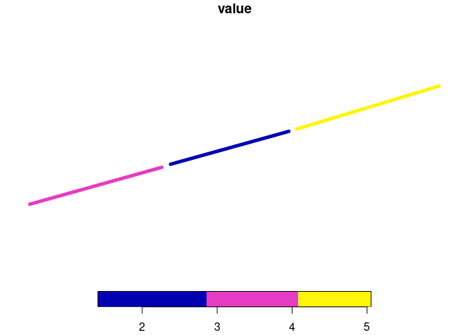

For local development run this in the `r` directory:

``` r
devtools::load_all()
```

    ℹ Loading rnetmatch

You may also want to install it locally:

``` r
devtools::install()
```

And clean up previous builds:

``` r
rextendr::clean()
```

``` r
library(dplyr)
```


    Attaching package: 'dplyr'

    The following objects are masked from 'package:stats':

        filter, lag

    The following objects are masked from 'package:base':

        intersect, setdiff, setequal, union

Basic test

``` r
x = sf::read_sf("data-raw/geojson/princes_street_minimal_x_1.geojson")
x = x |> sf::st_transform("EPSG:27700")
y = sf::read_sf("data-raw/geojson/princes_street_minimal.geojson")
y = y |> sf::st_transform("EPSG:27700")
```

``` r
bind_rows(
  x |>
    transmute(value = "x"),
  y |>
    transmute(value = as.character(value))
) |>
  plot(lwd = 5)
```



``` r
matched_df = rnet_match(x, y, dist_tolerance = 20, slope_tolerance = 0.1, trees = "xy")
y_to_match = y |>
  transmute(j = 1:n(), value) |>
  sf::st_drop_geometry() 
matched_df_y = left_join(matched_df, y_to_match)
```

    Joining with `by = join_by(j)`

``` r
x$length_x = sf::st_length(x) |>
  # Drop units:
  units::drop_units()
x_to_match = x |>
  transmute(i = 1:n(), length_x) |>
  sf::st_drop_geometry()
matched_df_xy = left_join(matched_df_y, x_to_match)
```

    Joining with `by = join_by(i)`

``` r
x_formula = matched_df_xy |>
  mutate(value_formula = value * shared_len / length_x)
x_formula
```

      i j shared_len value length_x value_formula
    1 1 4 66.1969445     4 71.68314   3.693863952
    2 1 1  0.5893015     1 71.68314   0.008220921
    3 2 2 17.3321012     2 64.16447   0.540239849
    4 2 1 57.0626066     1 64.16447   0.889317851
    5 2 3 12.5390962     3 64.16447   0.586263551
    6 3 3 69.7763265     3 77.58872   2.697930711
    7 3 2 67.8390165     2 77.58872   1.748682541

``` r
x_with_values = x_formula |>
  group_by(id = i) |>
  summarise(
    value = sum(value_formula),
    length_x = first(length_x)
    )
x_joined = left_join(x, x_with_values)
```

    Joining with `by = join_by(id, length_x)`

The total length travelled on each network can be calculated as follows:

``` r
total_distance_x = sum(x_joined$value * x_joined$length_x)
round(total_distance_x)
```

    [1] 740

And for `y`:

``` r
total_distance_y = sum(as.numeric(y$value * sf::st_length(y)))
```

We can post process the joined x network to get the total length
travelled on each network:

``` r
x_joined = x_joined |>
  mutate(value = value * total_distance_y / total_distance_x)
```

That results in these values:

``` r
round(x_joined$value)
```

    [1] 4 2 5

``` r
y |>
  select(value) |>
  plot(lwd = 5)
x_joined |>
  select(value) |>
  plot(lwd = 5)
```




