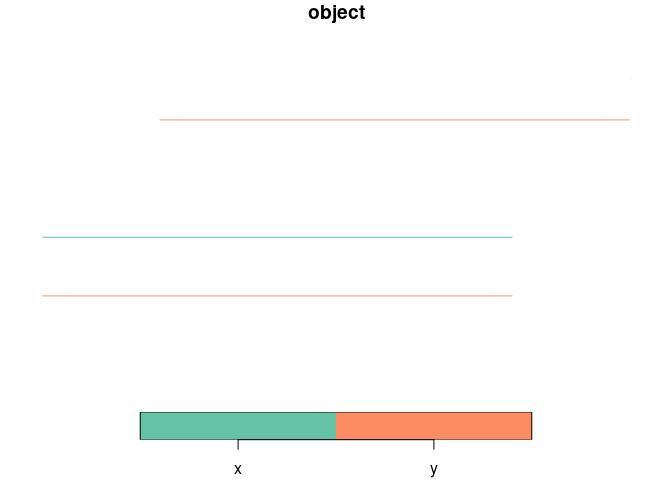
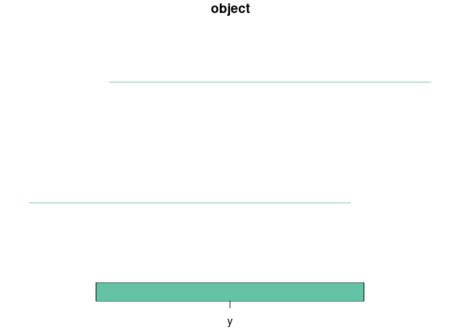

For local development run this in the `r` directory:

``` r
devtools::load_all()
```

    ℹ Loading rnetmatch

Install it locally with:

``` r
devtools::build()
```

And clean up previous builds:

``` r
rextendr::clean()
```

``` r
library(dplyr)
```


    Attaching package: 'dplyr'

    The following object is masked from 'package:testthat':

        matches

    The following objects are masked from 'package:stats':

        filter, lag

    The following objects are masked from 'package:base':

        intersect, setdiff, setequal, union

# Basic test

``` r
x = sf::st_sf(
  geometry = sf::st_sfc(
    sf::st_linestring(matrix(c(1, 1, 5, 1), ncol = 2, byrow = TRUE))
  )
)

y = sf::st_sf(
  geometry = c(
    sf::st_sfc(
      sf::st_linestring(matrix(c(2, 2, 6, 2), ncol = 2, byrow = TRUE))
    ),
    sf::st_sfc(
      sf::st_linestring(matrix(c(1, 0.5, 5, 0.5), ncol = 2, byrow = TRUE))
    )
  )
)
x$object = "x"
y$object = "y"
xy = rbind(
  x,
  y
)
plot(xy)
plot(x, add = TRUE)
```



``` r
plot(y)
```



# Another test

``` r
list.files("data-raw/geojson")
```

    [1] "x_negative.geojson" "y_negative.geojson"

``` r
x = sf::read_sf("inst/extdata/princes_street_minimal_x_1.geojson")
x = x |> sf::st_transform("EPSG:27700")
y = sf::read_sf("inst/extdata/princes_street_minimal.geojson")
y = y |> sf::st_transform("EPSG:27700")
```

``` r
bind_rows(
  x |>
    transmute(value = "x"),
  y |>
    transmute(value = as.character(value))
) |>
  plot(lwd = 5)
```


``` r
nrow(x)
```

    [1] 3

``` r
nrow(y)
```

    [1] 4

``` r
matched_df = rnet_match(x, y, dist_tolerance = 20, angle_tolerance = 20, trees = "xy")
nrow(matched_df)
```

    [1] 7

``` r
matched_df
```

      i j shared_len
    1 1 4 69.6747102
    2 1 1  0.6118779
    3 2 2 10.8678977
    4 2 1 51.1495361
    5 2 3 13.0149316
    6 3 3 77.5887159
    7 3 2 77.5887159

``` r
length_x = sf::st_length(x) |>
  # Drop units:
  units::drop_units()
length_x
```

    [1] 71.68314 64.16447 77.58872

``` r
y_to_match = y |>
  transmute(j = 1:n(), value) |>
  sf::st_drop_geometry() 
matched_df_y = left_join(matched_df, y_to_match)
```

    Joining with `by = join_by(j)`

``` r
x_to_match = x |>
  transmute(i = 1:n(), length_x) |>
  sf::st_drop_geometry()
matched_df_xy = left_join(matched_df_y, x_to_match)
```

    Joining with `by = join_by(i)`

``` r
x_formula = matched_df_xy |>
  mutate(value_formula = value * shared_len / length_x)
x_formula
```

      i j shared_len value length_x value_formula
    1 1 4 69.6747102     4 71.68314   3.887927191
    2 1 1  0.6118779     1 71.68314   0.008535869
    3 2 2 10.8678977     2 64.16447   0.338751276
    4 2 1 51.1495361     1 64.16447   0.797162946
    5 2 3 13.0149316     3 64.16447   0.608511163
    6 3 3 77.5887159     3 77.58872   3.000000000
    7 3 2 77.5887159     2 77.58872   2.000000000

``` r
x_with_values = x_formula |>
  group_by(id = i) |>
  summarise(
    value = sum(value_formula),
    length_x = first(length_x)
    )
x_joined = left_join(x, x_with_values)
```

    Joining with `by = join_by(id)`

The total length travelled on each network can be calculated as follows:

``` r
total_distance_x = sum(x_joined$value * x_joined$length_x)
round(total_distance_x)
```

    [1] 779

And for `y`:

``` r
total_distance_y = sum(as.numeric(y$value * sf::st_length(y)))
total_distance_y
```

    [1] 826.2815

We can post process the joined x network to get the total length
travelled on each network:

``` r
x_joined = x_joined |>
  mutate(value = value * total_distance_y / total_distance_x)
```

That results in these values:

``` r
x_joined$value
```

    [1] 4.131981 1.849866 5.302220

``` r
round(x_joined$value)
```

    [1] 4 2 5

``` r
y |>
  select(value) |>
  plot(lwd = 5)
x_joined |>
  select(value) |>
  plot(lwd = 5)
```


