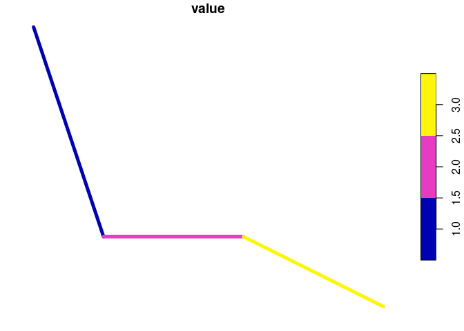
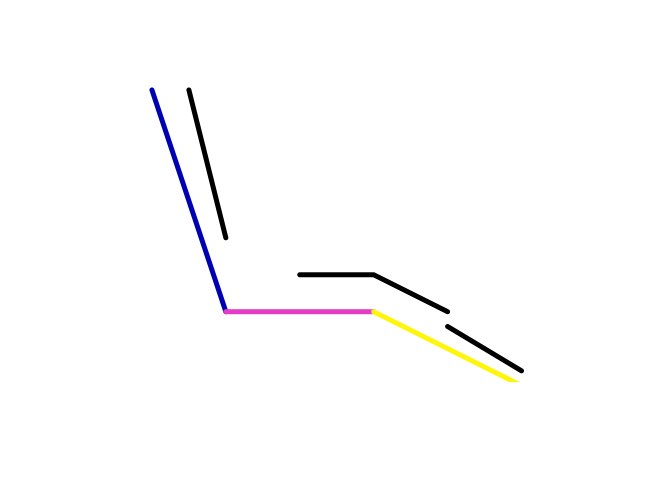
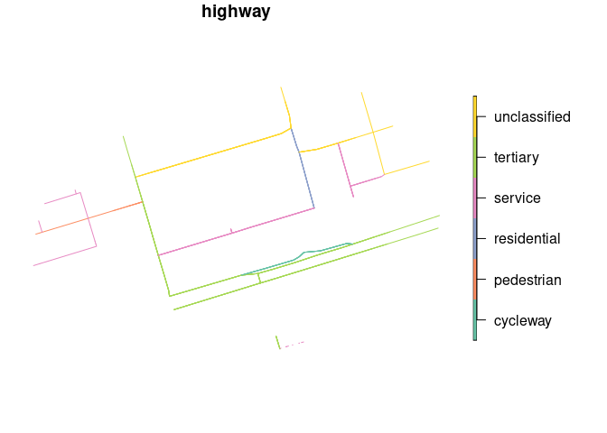
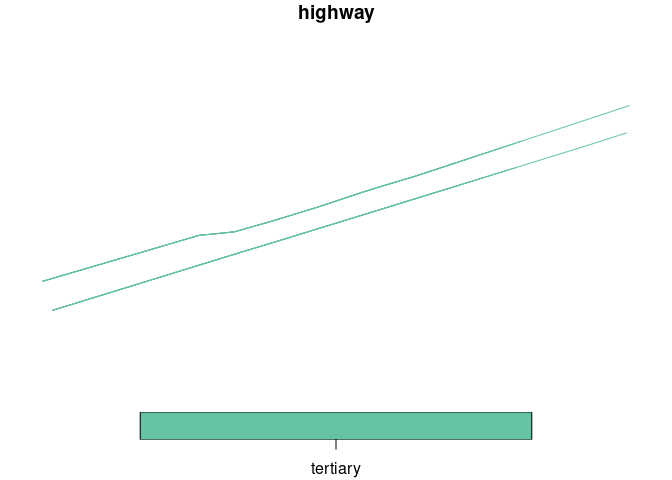
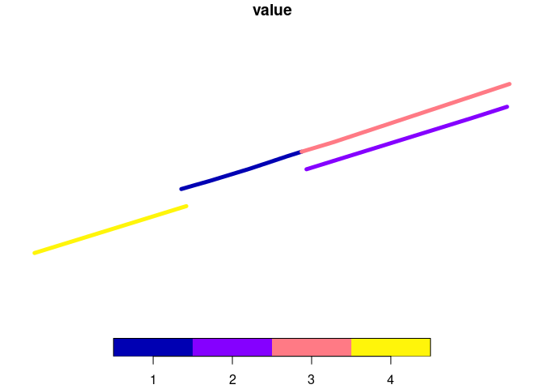

``` r
library(dplyr)
library(sf)
```

    Linking to GEOS 3.11.1, GDAL 3.6.4, PROJ 9.1.1; sf_use_s2() is TRUE

## Simple examples

With negative slope in y:

``` r
y_downslope_1 = as.matrix(
  tibble::tribble(
    ~x, ~y,
    0, 3,
    1, 0,
    )
) |>
  sf::st_linestring()
y_downslope_2 = as.matrix(
  tibble::tribble(
    ~x, ~y,
    1, 0,
    3, 0,
    )
) |>
  sf::st_linestring()
# With slight downslope:
y_downslope_3 = as.matrix(
  tibble::tribble(
    ~x, ~y,
    3, 0,
    5, -1,
    )
) |>
  sf::st_linestring()
y_negative = sf::st_as_sf(
  data.frame(value = 1:3),
  geometry = sf::st_sfc(list(y_downslope_1, y_downslope_2, y_downslope_3))
)
```

``` r
y_negative |>
  plot(lwd = 5)
```



``` r
x_negative_1 = as.matrix(
  tibble::tribble(
    ~x, ~y,
    .5, 3,
    1, 1,
    )
) |>
  sf::st_linestring()
x_negative_2 = as.matrix(
  tibble::tribble(
    ~x, ~y,
    2, 0.5,
    3, 0.5,
    4, 0
    )
) |>
  sf::st_linestring()
x_negative_3 = as.matrix(
  tibble::tribble(
    ~x, ~y,
    4, -.2,
    5, -.8,
    )
) |>
  sf::st_linestring()
x_negative = sf::st_as_sf(
  data.frame(id = 1:3),
  geometry = sf::st_sfc(list(x_negative_1, x_negative_2, x_negative_3))
)
plot(x_negative$geometry, lwd = 5)
plot(y_negative, add = TRUE, lwd = 5)
```



``` r
sf::write_sf(y_negative, "geojson/y_negative.geojson", delete_dsn = TRUE)
```

    writing: substituting ENGCRS["Undefined Cartesian SRS with unknown unit"] for missing CRS

``` r
sf::write_sf(x_negative, "geojson/x_negative.geojson", delete_dsn = TRUE)
```

    writing: substituting ENGCRS["Undefined Cartesian SRS with unknown unit"] for missing CRS

## OSM examples

``` r
edinburgh_zones = zonebuilder::zb_zone("Edinburgh")
```

    Loading required namespace: tmaptools

``` r
edinburgh_central_3km = edinburgh_zones |>
  filter(circle_id <= 2) |>
  sf::st_union()
osm_edinburgh_central = osmextract::oe_get_network("Edinburgh", boundary = edinburgh_central_3km, boundary_type = "clipsrc")
```

    No exact match found for place = Edinburgh and provider = geofabrik. Best match is Limburg. 
    Checking the other providers.

    An exact string match was found using provider = bbbike.

    The chosen file was already detected in the download directory. Skip downloading.

    Starting with the vectortranslate operations on the input file!

    0...10...20...30...40...50...60...70...80...90...100 - done.

    Warning in CPL_gdalvectortranslate(source, destination, options, oo, doo, :
    GDAL Message 1: A geometry of type MULTILINESTRING is inserted into layer lines
    of geometry type LINESTRING, which is not normally allowed by the GeoPackage
    specification, but the driver will however do it. To create a conformant
    GeoPackage, if using ogr2ogr, the -nlt option can be used to override the layer
    geometry type. This warning will no longer be emitted for this combination of
    layer and feature geometry type.

    Finished the vectortranslate operations on the input file!

    Reading layer `lines' from data source 
      `/home/robin/data/osm/bbbike_Edinburgh.gpkg' using driver `GPKG'
    Simple feature collection with 7203 features and 12 fields
    Geometry type: MULTILINESTRING
    Dimension:     XY
    Bounding box:  xmin: -3.236391 ymin: 55.92643 xmax: -3.140402 ymax: 55.98029
    Geodetic CRS:  WGS 84

``` r
meuse_lane = osm_edinburgh_central |>
  filter(name == "Meuse Lane")
meuse_lane_buffer = sf::st_buffer(meuse_lane, 100)
osm_edinburgh_central = osm_edinburgh_central |>
  sf::st_intersection(meuse_lane_buffer)
```

    Warning: attribute variables are assumed to be spatially constant throughout
    all geometries

``` r
osm_edinburgh_central |>
  select(highway) |>
  plot()
```



``` r
princes_street_central = osm_edinburgh_central |>
  mutate(n = 1:n()) |>
  filter(name == "Princes Street")
princes_street_central |>
  select(highway) |>
  plot()
```



``` r
# Check each link:
princes_street_central |>
  select(n) |>
  plot(lwd = 5)
```


``` r
princes_street_minimal = princes_street_central |>
  slice(1:4)
princes_street_minimal = princes_street_minimal |>
  mutate(value = 1:n()) |>
  select(value, name, osm_id)
princes_street_minimal |>
  select(value) |>
  plot(lwd = 5)
```



``` r
m = mapview::mapview(princes_street_minimal)
princes_street_minimal_x = mapedit::editMap(m)
names(princes_street_minimal_x)
princes_street_minimal_x_1 = princes_street_minimal_x$drawn
princes_street_minimal_x_1 = princes_street_minimal_x_1 |>
  transmute(id = 1:n())
```

``` r
bind_rows(
  princes_street_minimal |>
    transmute(value = as.character(value)),
  princes_street_minimal_x_1 |>
    transmute(value = "x")
) |>
  plot(lwd = 5)
```

``` r
dir.create("geojson")
sf::write_sf(princes_street_minimal, "geojson/princes_street_minimal.geojson", delete_dsn = TRUE)
sf::write_sf(princes_street_minimal_x_1, "geojson/princes_street_minimal_x_1.geojson", delete_dsn = TRUE)
```
