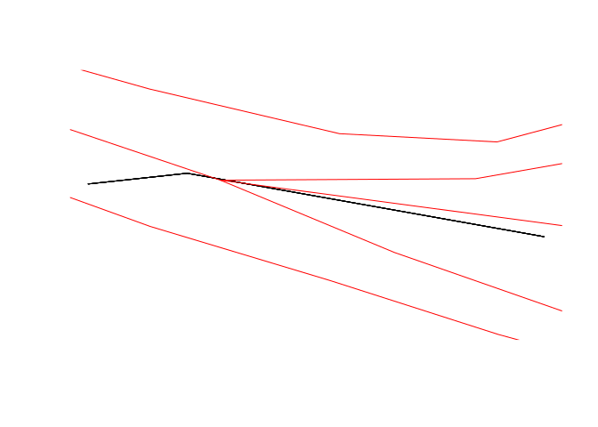

This is an example showing how `rnetmatch` can be used with `st_join`,
from issue [\#35](https://github.com/nptscot/rnetmatch/issues/35).

``` r
library(sf)
```

    Linking to GEOS 3.12.1, GDAL 3.8.4, PROJ 9.3.1; sf_use_s2() is TRUE

``` r
library(rnetmatch)
library(dplyr)
```


    Attaching package: 'dplyr'

    The following objects are masked from 'package:stats':

        filter, lag

    The following objects are masked from 'package:base':

        intersect, setdiff, setequal, union

``` r
crop_box <- st_bbox(c("xmin" = 427200, xmax = 427500, ymin = 433550, ymax = 433700))

rnet_y <- "https://raw.githubusercontent.com/nptscot/networkmerge/main/data/rnet_armley.geojson" |> 
  read_sf() |>
  # st_geometry() |> 
  st_transform(27700) |> 
  st_crop(crop_box)
```

    Warning: attribute variables are assumed to be spatially constant throughout
    all geometries

``` r
names(rnet_y)
```

    [1] "local_id"       "bicycle"        "govtarget_slc"  "govnearmkt_slc"
    [5] "gendereq_slc"   "dutch_slc"      "ebike_slc"      "geometry"      

``` r
# The target geometry:
rnet_x <- "https://raw.githubusercontent.com/nptscot/networkmerge/main/data/rnet_armley_line.geojson" |>
  read_sf() |> 
  st_crop(crop_box) 
rnet_x$id <- 1:nrow(rnet_x)
names(rnet_x)
```

    [1] "geometry" "id"      

We’ll do the default join as follows:

``` r
x_y_joined_st_intersects = st_join(rnet_x, rnet_y)
```

Now with `rnetmatch`:

``` r
# create matches
matches <- rnetmatch::rnet_match(rnet_x, rnet_y, 10, 10)

# function with signature to work with st_join
match_keys <- function(.x = NULL, .y = NULL, matches) {
  dplyr::left_join(tibble::tibble(i = 1:max(matches$i)), matches) |> 
    dplyr::group_by(i) |> 
    dplyr::summarise(j = list(c(j))) |> 
    tibble::deframe() |> 
    lapply(\(.x) {
      if (all(is.na(.x))) {
        integer()
      } else {
        .x
      }
    })
}

x_y_joined_rnetmatch_10_10 <- st_join(
  rnet_x,
  rnet_y,
  join = match_keys,
  # pass matches via dots 
  matches = matches
)
```

    Joining with `by = join_by(i)`

Let’s take a look at the results, compared with the default join
(`st_intersects()`)

``` r
waldo::compare(
  names(x_y_joined_st_intersects),
  names(x_y_joined_rnetmatch_10_10)
)
```

    ✔ No differences

Let’s look at the number of rows:

``` r
nrow(rnet_x)
```

    [1] 16

``` r
nrow(rnet_y)
```

    [1] 17

``` r
waldo::compare(
  nrow(x_y_joined_rnetmatch_10_10),
  nrow(x_y_joined_st_intersects)
)
```

    `old`: 29
    `new`: 26

``` r
summary(duplicated(x_y_joined_rnetmatch_10_10$geometry))
```

       Mode   FALSE    TRUE 
    logical      16      13 

``` r
summary(duplicated(x_y_joined_st_intersects$geometry))
```

       Mode   FALSE    TRUE 
    logical      16      10 

Let’s check that all the geomtries are from `rnet_x`:

``` r
summary(x_y_joined_rnetmatch_10_10$geometry %in% rnet_x$geometry)
```

       Mode    TRUE 
    logical      29 

And let’s look at the joined features with the highest number of
matches:

``` r
x_y_joined_rnetmatch_10_10_most <- x_y_joined_rnetmatch_10_10 |> 
  group_by(id) |>
  mutate(n = n())
max_n = max(x_y_joined_rnetmatch_10_10_most$n)
x_y_joined_rnetmatch_10_10_most = x_y_joined_rnetmatch_10_10_most |> 
  filter(n == max_n)
```

``` r
y_matching_most = rnet_y |> 
  filter(local_id %in% x_y_joined_rnetmatch_10_10_most$local_id)
```

``` r
plot(x_y_joined_rnetmatch_10_10_most$geometry)
plot(y_matching_most$geometry, add = TRUE, col = "red")
```


