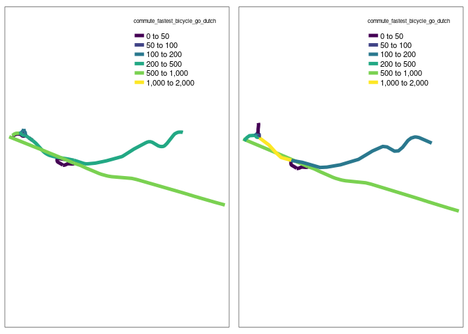
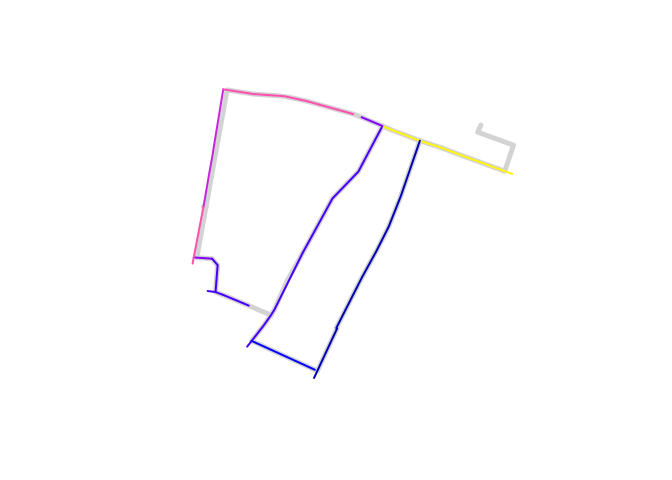
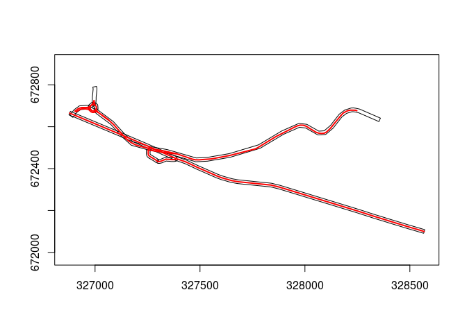
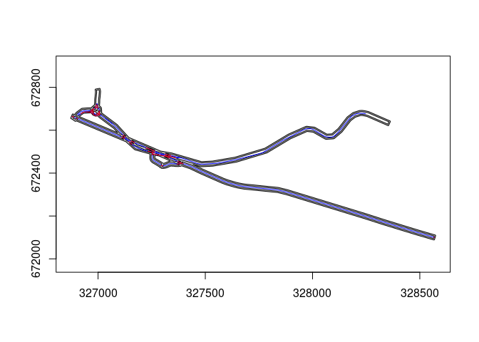

# Demonstration of matching route networks


``` r
devtools::load_all()
```

    ℹ Loading rnetmatch

``` r
# remotes::install_dev("rsgeo")
# remotes::install_dev("stplanr")
```

``` r
library(stplanr)
library(tmap)
```

    Breaking News: tmap 3.x is retiring. Please test v4, e.g. with
    remotes::install_github('r-tmap/tmap')

``` r
library(sf)
```

    Linking to GEOS 3.11.1, GDAL 3.6.4, PROJ 9.1.1; sf_use_s2() is TRUE

``` r
library(rsgeo)
rnet_y = route_network_small["flow"]
rnet_y$id = 1:nrow(rnet_y)
# The target object
rnet_x = rnet_subset(osm_net_example[1], rnet_y)
```

    Warning: attribute variables are assumed to be spatially constant throughout
    all geometries

    Warning in st_cast.sf(sf::st_cast(x, "MULTILINESTRING"), "LINESTRING"):
    repeating attributes for all sub-geometries for which they may not be constant

    Joining with `by = join_by(osm_id)`

``` r
# Get start and end points for each linestring in rnet_x:
rnet_x_s = lwgeom::st_startpoint(rnet_x)
rnet_x_e = lwgeom::st_endpoint(rnet_x)
plot(rnet_x$geometry, lwd = 9, col = "lightgrey")
plot(rnet_y["flow"], add = TRUE, lwd = 5)
plot(rnet_x_s, add = TRUE, pch = 3)
plot(rnet_x_e, add = TRUE, pch = 3)
```


Here are the examples of an intersection road.

``` r
rnet_intersection_complex = sf::read_sf("https://github.com/nptscot/rnetmatch/releases/download/intersection_road/intersection_example_complex.geojson")
rnet_intersection_simple = sf::read_sf("https://github.com/nptscot/rnetmatch/releases/download/intersection_road/intersection_example_simple.geojson")
rnet_intersection_simple$index = seq_along(rnet_intersection_simple$geometry)

rnet_intersection_simple = rnet_intersection_simple[, c("index", setdiff(names(rnet_intersection_simple), "index"))]


rnet_intersection_simple <- rnet_intersection_simple[c("index", "geometry")]

plot(rnet_intersection_complex$geometry, lwd = 20, col = "blue")
plot(rnet_intersection_simple$geometry, col = "red", add = TRUE, lwd = 5)
```


## Minimal example

A minimal example can be seen below:

``` r
# setup input dataset:
x = sf::read_sf("data-raw/geojson/princes_street_minimal_x_1.geojson") |>
  sf::st_transform(27700)
y = sf::read_sf("data-raw/geojson/princes_street_minimal.geojson") |>
  sf::st_transform(27700)

x = x[3, ]
y = y[2:3, ]
matches <- rnetmatch::rnet_match(x, y, dist_tolerance = 10, angle_tolerance = 5)
y_aggregated <- rnet_aggregate(x, y, matches, value)
y_joined <- cbind(x, y_aggregated)
y_joined
```

    Simple feature collection with 1 feature and 3 fields
    Geometry type: LINESTRING
    Dimension:     XY
    Bounding box:  xmin: 325720.5 ymin: 673966.8 xmax: 325794.8 ymax: 673989.3
    Projected CRS: OSGB36 / British National Grid
      id i    value                       geometry
    1  3 1 4.010027 LINESTRING (325720.5 673966...

``` r
x_segmented = stplanr::line_segment(x, segment_length = 10)
matches <- rnetmatch::rnet_match(x_segmented, y, dist_tolerance = 10, angle_tolerance = 5)
y_joined_segmented <- rnet_aggregate(x_segmented, y, matches, value)
y_joined_segmented
```

    # A tibble: 8 × 2
          i value
      <int> <dbl>
    1     1 0.501
    2     2 0.501
    3     3 0.501
    4     4 0.501
    5     5 0.501
    6     6 0.501
    7     7 0.501
    8     8 0.501

``` r
sum(y_joined_segmented$value)
```

    [1] 4.010027

``` r
funs = list(value = sum)
# With stplanr:
rnet_merged = stplanr::rnet_merge(x, y, dist = 10, funs = funs, max_angle_diff = 5, sum_flows = FALSE)
```

    Warning: st_centroid assumes attributes are constant over geometries

    Joining with `by = join_by(id)`

``` r
rnet_merged_segmented = stplanr::rnet_merge(x_segmented, y, dist = 10, funs = funs, max_angle_diff = 5, sum_flows = FALSE)
```

    Warning: st_centroid assumes attributes are constant over geometries

    Joining with `by = join_by(id)`

``` r
rnet_merged$value
```

    [1] 5

``` r
rnet_merged_segmented$value
```

    [1] 5 5 5 5 5 5 5 5

## Intersection example

This is where the rnet_merge function struggles to handle the
intersection road.

``` r
rnet_xp = sf::st_transform(rnet_intersection_simple , "EPSG:27700")
rnet_yp = sf::st_transform(rnet_intersection_complex, "EPSG:27700")

# rnet_xp <- line_segment(rnet_xp, segment_length = 10)
# rnet_yp <- line_segment(rnet_yp, segment_length = 10)


result <- st_join(rnet_xp, rnet_yp, join = st_intersects)

names(rnet_xp)
```

    [1] "index"    "geometry"

``` r
# Extract column names from the rnet_yp
name_list = names(rnet_yp)

# Initialize an empty list
funs = list()

# Loop through each name and assign it a function based on specific conditions
for (name in name_list) {
  if (name == "geometry") {
    next  # Skip the current iteration
  } else if (name %in% c("gradient", "quietness")) {
    funs[[name]] = mean
  } else {
    funs[[name]] = sum
  }
}


dist = 20
angle = 40
rnet_merged = stplanr::rnet_merge(rnet_xp, rnet_yp, dist = dist, funs = funs, max_angle_diff = angle)
```

    Warning: st_centroid assumes attributes are constant over geometries

    Joining with `by = join_by(index)`

``` r
# Explore distance travelled:
sum(rnet_merged$commute_fastest_bicycle_go_dutch * sf::st_length(rnet_merged$geometry))
```

    1758359 [m]

``` r
# And for the complex network:
sum(rnet_yp$commute_fastest_bicycle_go_dutch * sf::st_length(rnet_yp$geometry))
```

    1758359 [m]

``` r
tmap_mode("plot") # Set to view for interactive mode
```

    tmap mode set to plotting

``` r
brks = c(0, 50, 100, 200, 500,1000,2000)
m1 = tm_shape(rnet_intersection_complex) + tm_lines("commute_fastest_bicycle_go_dutch", palette = "viridis", breaks = brks, lwd = 5)
m2 = tm_shape(rnet_merged) + tm_lines("commute_fastest_bicycle_go_dutch", palette = "viridis", breaks = brks, lwd = 5)
tmap_arrange(m1, m2, nrow = 1, sync = TRUE)
```



The stplanr solution was as follows:

``` r
rnet_y$quietness <- rnorm(nrow(rnet_y))
funs <- list(flow = sum, quietness = mean)
rnet_merged <- rnet_merge(rnet_x[1], rnet_y[c("flow", "quietness")],
  dist = 9, segment_length = 20, funs = funs
)
```

    Warning in line_segment_rsgeo(l, n_segments = n_segments): The CRS of the input object is latlon.
    This may cause problems with the rsgeo implementation of line_segment().

    Joining with `by = join_by(osm_id)`

``` r
plot(rnet_y$geometry, lwd = 5, col = "lightgrey")
plot(rnet_merged["flow"], add = TRUE, lwd = 2)
```



Note that this leaves gaps in the network.

Although this gap issue can be fixed by using a smaller segment_length,
e.g. segment_length = 5, this is not a computationally efficient way to
solve the problem.

``` r
rnet_y$quietness <- rnorm(nrow(rnet_y))
funs <- list(flow = sum, quietness = mean)
rnet_merged <- rnet_merge(rnet_x[1], rnet_y[c("flow", "quietness")],
  dist = 9, segment_length = 5, funs = funs
)
```

    Warning in line_segment_rsgeo(l, n_segments = n_segments): The CRS of the input object is latlon.
    This may cause problems with the rsgeo implementation of line_segment().

    Joining with `by = join_by(osm_id)`

``` r
plot(rnet_y$geometry, lwd = 5, col = "lightgrey")
plot(rnet_merged["flow"], add = TRUE, lwd = 2)
```


Also, the join syntax is a bit clunky.

## With Rust implementation

``` r
rnet_x = rnet_x |>
  sf::st_transform("EPSG:27700")
rnet_y = rnet_y |>
  sf::st_transform("EPSG:27700")
rnet_y$value = rnet_y$flow
x <- as_rsgeo(rnet_x)
y <- as_rsgeo(rnet_y)
res <- rsgeo:::rnet_merge(x, y, 20, 0.2)  
excluded <- setdiff(1:length(x), res$from)
from <- rnet_x[res$from,]
to <- lapply(res$to, \(.i) rnet_y[.i,])
to_mean_value <- sapply(res$to, \(.i) mean(rnet_y$value[.i]))
rnet_matched_rsgeo = dplyr::bind_cols(from, value = to_mean_value)
plot(rnet_matched_rsgeo["value"], lwd = 3)
```


## `rnet_join_geos`

``` r
rnet_xp = rnet_xp |> 
  dplyr::mutate(identifier = 1:nrow(rnet_xp)) |> 
  dplyr::select(identifier, dplyr::everything())
rnet_yp = rnet_yp |> 
  dplyr::transmute(value = commute_fastest_bicycle_go_dutch)
rnet_matched = rnet_join_geos(rnet_xp, rnet_yp, distance = 9, dist_chop = 1)
rnet_matched_agg = rnet_matched |>
  dplyr::group_by(identifier) |>
  dplyr::summarise(value = sum(value))
rnet_joined = rnet_xp |>
  dplyr::left_join(rnet_matched_agg)
```

    Joining with `by = join_by(identifier)`

``` r
summary(rnet_joined)
```

       identifier       index               geometry      value       
     Min.   : 1.0   Min.   : 1.0   LINESTRING   :11   Min.   :   1.0  
     1st Qu.: 3.5   1st Qu.: 3.5   epsg:27700   : 0   1st Qu.: 142.0  
     Median : 6.0   Median : 6.0   +proj=tmer...: 0   Median : 509.5  
     Mean   : 6.0   Mean   : 6.0                      Mean   : 496.3  
     3rd Qu.: 8.5   3rd Qu.: 8.5                      3rd Qu.: 682.5  
     Max.   :11.0   Max.   :11.0                      Max.   :1627.0  
                                                      NA's   :1       

``` r
# rnet_joined$value
plot(rnet_joined["value"], lwd = 3)
```


``` r
plot(rnet_yp["value"], lwd = 3)
```


``` r
plot(rnet_matched)
```


## With `{geos}`: details

Let’s try doing the same thing but with `geos`. First we’ll reproject
the data.

``` r
rnet_x = rnet_intersection_simple
rnet_y = rnet_intersection_complex
rnet_x_projected = st_transform(rnet_intersection_simple, "EPSG:27700")
rnet_y_projected = st_transform(rnet_intersection_complex, "EPSG:27700")
```

Then we’ll convert to `geos` objects.

``` r
rnet_x_geos = geos::as_geos_geometry(rnet_x_projected)
rnet_y_geos = geos::as_geos_geometry(rnet_y_projected)
```

We’ll create a buffer around `rnet_x`:

``` r
params = geos::geos_buffer_params(end_cap_style = "flat")
rnet_x_buffer = geos::geos_buffer(rnet_x_geos, 9, params = params)
plot(rnet_x_buffer)
plot(rnet_y_geos, add = TRUE, col = "red", lwd = 2)
```



Now let’s ‘chop’ the source geometry into segments that fit within the
buffer:

``` r
# Convert to linestring:
rnet_xbl = geos::geos_boundary(rnet_x_buffer)
rnet_xblb = geos::geos_buffer(rnet_xbl, 3, params = params)
rnet_xlbc = geos::geos_make_collection(rnet_xblb)
rnet_xlbcu = geos::geos_unary_union(rnet_xlbc)
rnet_y_remove = geos::geos_intersection(
  rnet_y_geos,
  rnet_xlbcu
)
plot(rnet_xlbcu, col = "grey" )
plot(rnet_y_geos, col = "blue", add = TRUE)
plot(rnet_y_remove, col = "red",add = TRUE)
```



``` r
plot(rnet_xlbcu, col = "lightgrey")
plot(rnet_y_remove, add = TRUE, col = "red", lwd = 2)
```


The red bits are the parts of the source geometry `rnet_y` that we
*don’t* want. Let’s get the bits that we *do* want:

``` r
rnet_y_chopped = geos::geos_difference(
  rnet_y_geos,
  rnet_xlbcu
)
plot(rnet_xlbcu)
plot(rnet_x_buffer, add = TRUE, col = "lightgrey", border = NA)
plot(rnet_y_chopped, add = TRUE, col = "red", lwd = 2)
```


<!-- For every 'chopped' linestring there is at least one matching linestring in `rnet_y`.
Let's find them as follows: -->
<!-- That shows that we're not quite ready to join the data: we need to exclude the red bits that are outside the original buffer. -->

``` r
rnet_ycl = geos::geos_unnest(rnet_y_chopped, keep_multi = FALSE)
rnet_ycj = geos::geos_inner_join_keys(
  rnet_ycl,
  rnet_y_geos
)
plot(rnet_ycl)
```


We can also join `rnet_y_chopped` and `rnet_ycl` to `rnet_x_buffer` to
get the buffer geometry:

``` r
rnet_ycj = geos::geos_inner_join_keys(
  rnet_y_chopped,
  rnet_x_buffer
)
nrow(rnet_ycj)
```

    [1] 37

``` r
length(rnet_y_chopped)
```

    [1] 32

``` r
length(unique(rnet_ycj$x))
```

    [1] 27

``` r
length(unique(rnet_ycj$y))
```

    [1] 11

``` r
plot(rnet_ycj)
```


``` r
rnet_y
```

    Simple feature collection with 32 features and 32 fields
    Geometry type: LINESTRING
    Dimension:     XY
    Bounding box:  xmin: -3.17222 ymin: 55.93662 xmax: -3.14503 ymax: 55.94199
    Geodetic CRS:  WGS 84
    # A tibble: 32 × 33
       all_fastest_bicycle all_fastest_bicycle_ebike all_fastest_bicycle_go_dutch
                     <dbl>                     <dbl>                        <dbl>
     1                   0                         0                            0
     2                   0                         0                            0
     3                   0                         0                            0
     4                   0                         0                            0
     5                   0                         0                            0
     6                   0                        52                            3
     7                   0                        15                            8
     8                   0                       164                            9
     9                   0                       164                            9
    10                   0                       164                            9
    # ℹ 22 more rows
    # ℹ 30 more variables: all_quietest_bicycle <dbl>,
    #   all_quietest_bicycle_ebike <dbl>, all_quietest_bicycle_go_dutch <dbl>,
    #   commute_fastest_bicycle <dbl>, commute_fastest_bicycle_ebike <dbl>,
    #   commute_fastest_bicycle_go_dutch <dbl>, commute_quietest_bicycle <dbl>,
    #   commute_quietest_bicycle_ebike <dbl>,
    #   commute_quietest_bicycle_go_dutch <dbl>, primary_fastest_bicycle <dbl>, …

``` r
rnet_yclj = geos::geos_inner_join_keys(
  rnet_ycl,
  rnet_x_buffer
)
nrow(rnet_yclj)
```

    [1] 63

``` r
length(rnet_ycl)
```

    [1] 48

``` r
plot(rnet_yclj)
```


``` r
rnet_y
```

    Simple feature collection with 32 features and 32 fields
    Geometry type: LINESTRING
    Dimension:     XY
    Bounding box:  xmin: -3.17222 ymin: 55.93662 xmax: -3.14503 ymax: 55.94199
    Geodetic CRS:  WGS 84
    # A tibble: 32 × 33
       all_fastest_bicycle all_fastest_bicycle_ebike all_fastest_bicycle_go_dutch
                     <dbl>                     <dbl>                        <dbl>
     1                   0                         0                            0
     2                   0                         0                            0
     3                   0                         0                            0
     4                   0                         0                            0
     5                   0                         0                            0
     6                   0                        52                            3
     7                   0                        15                            8
     8                   0                       164                            9
     9                   0                       164                            9
    10                   0                       164                            9
    # ℹ 22 more rows
    # ℹ 30 more variables: all_quietest_bicycle <dbl>,
    #   all_quietest_bicycle_ebike <dbl>, all_quietest_bicycle_go_dutch <dbl>,
    #   commute_fastest_bicycle <dbl>, commute_fastest_bicycle_ebike <dbl>,
    #   commute_fastest_bicycle_go_dutch <dbl>, commute_quietest_bicycle <dbl>,
    #   commute_quietest_bicycle_ebike <dbl>,
    #   commute_quietest_bicycle_go_dutch <dbl>, primary_fastest_bicycle <dbl>, …

``` r
rnet_ycj2 = geos::geos_inner_join_keys(
  rnet_y_geos,
  rnet_x_buffer
)
waldo::compare(rnet_ycj, rnet_ycj2)
```

    `attr(old, 'row.names')`: 13 15 17 18 22 35 36 39 55 56 and 55 more...
    `attr(new, 'row.names')`:  1  2  3  5  6  8 10 11 12 15            ...

    old vs new
                 x  y
    - old[1, ]   2  6
    + new[1, ]   1  1
    - old[2, ]   3  7
    + new[2, ]   1  3
    - old[3, ]   4  5
    + new[3, ]   1  6
    - old[4, ]   4  7
    + new[4, ]   2  3
    - old[5, ]   5  5
    + new[5, ]   2  6
    - old[6, ]   7  5
    + new[6, ]   3  7
    - old[7, ]   8  1
    + new[7, ]   4  5
    - old[8, ]   9  2
    + new[8, ]   4  7
    - old[9, ]  11  5
    + new[9, ]   4  8
    - old[10, ] 12  9
    + new[10, ]  5  5
    and 55 more ...

    `old$x`: 2 3 4 4 5 7 8 9 11 12 and 55 more...
    `new$x`: 1 1 1 2 2 3 4 4  4  5            ...

    `old$y`: 6 7 5 7 5 5 1 2 5 9 and 55 more...
    `new$y`: 1 3 6 3 6 7 5 7 8 5            ...

Now let’s join the dataframe versions:

``` r
rnet_y_df = sf::st_drop_geometry(rnet_y)
rnet_y_df_expanded = rnet_y_df[rnet_ycj$x, ]
rnet_x_df = sf::st_drop_geometry(rnet_x)
rnet_x_df_expanded = rnet_x_df[rnet_ycj$y, ]

rnet_y_df_expanded$index = rnet_x_df_expanded$index
nrow(rnet_y_df_expanded)
```

    [1] 37

``` r
nrow(rnet_y)
```

    [1] 32

``` r
rnet_x_agg = rnet_y_df_expanded |>
  dplyr::group_by(index) |>
  dplyr::summarise(
    commute_fastest_bicycle_go_dutch = sum(commute_fastest_bicycle_go_dutch),
    quietness = mean(Quietness)
  )
rnet_x_joined = dplyr::left_join(
    rnet_x,
    rnet_x_agg,
)
```

    Joining with `by = join_by(index)`

``` r
tmap_mode("plot") # Set to view for interactive mode
```

    tmap mode set to plotting

``` r
brks = c(0, 50, 100, 200, 500,1000,2000)
m1 = tm_shape(rnet_x_joined) + tm_lines("commute_fastest_bicycle_go_dutch", palette = "viridis", breaks = brks)
m2 = tm_shape(rnet_y) + tm_lines("commute_fastest_bicycle_go_dutch", palette = "viridis", breaks = brks)
tmap_arrange(m1, m2, nrow = 1, sync = TRUE)
```

    Warning: Values have found that are higher than the highest break


Let’s compare the old and new joined flows:

``` r
# place plots side by side
par(mfrow = c(1, 2))
plot(rnet_y$geometry, lwd = 5, col = "lightgrey")
plot(rnet_merged["flow"], add = TRUE, lwd = 2)

plot(rnet_y$geometry, lwd = 5, col = "lightgrey")
plot(rnet_x_joined["commute_fastest_bicycle_go_dutch"], add = TRUE, lwd = 2)
```


``` r
par(mfrow = c(1, 1))
```

To package this up we used the following commands:

``` r
usethis::use_description()
usethis::use_package("geos")
```

We created a function that takes `rnet_x` and `rnet_y` and returns a
dataframe with the joined data:

``` r
rnet_x = rnet_x_projected
rnet_y = rnet_y_projected
distance = 9
dist_chop = 0.1
rnet_join = function(
    rnet_x,
    rnet_y,
    distance = 9,
    dist_chop = 0.1
    ) {
  # Check CRS is projected:
  stopifnot(
    sf::st_is_longlat(rnet_x) == FALSE,
    sf::st_is_longlat(rnet_y) == FALSE
  )
  rnet_x_geos = geos::as_geos_geometry(rnet_x)
  rnet_y_geos = geos::as_geos_geometry(rnet_y)
  params = geos::geos_buffer_params(end_cap_style = "flat")
  rnet_x_buffer = geos::geos_buffer(rnet_x_geos, distance, params = params)
  rnet_xbl = geos::geos_boundary(rnet_x_buffer)
  rnet_xblb = geos::geos_buffer(rnet_xbl, dist_chop, params = params)
  rnet_xlbc = geos::geos_make_collection(rnet_xblb)
  rnet_xlbcu = geos::geos_unary_union(rnet_xlbc)
  rnet_y_chopped = geos::geos_difference(
    rnet_y_geos,
    rnet_xlbcu
  )
  rnet_ycj = geos::geos_inner_join_keys(
    rnet_y_chopped,
    rnet_x_buffer
  )
  rnet_y_df = sf::st_drop_geometry(rnet_y)
  rnet_y_df_expanded = rnet_y_df[rnet_ycj$x, ]
  rnet_y_df_expanded$id_x = rnet_x_df[[1]][rnet_ycj$y]
  # Replace 'id_x' with the name of the first column in rnet_x_df:
  nx = which(names(rnet_y_df_expanded) == "id_x")
  new_name = names(rnet_x_df)[1]
  names(rnet_y_df_expanded)[nx] = new_name
  rnet_y_df_expanded
}
# Test it:
res = rnet_join(rnet_x, rnet_y)
res
res |>
  dplyr::group_by(id) |>
  dplyr::summarise(
    osm_ids = paste(osm_id, collapse = ", ")
  )
```

# Benchmark

Let’s test it on a larger dataset:

``` r
rnet_x = sf::read_sf("https://github.com/ropensci/stplanr/releases/download/v1.0.2/rnet_x_ed.geojson")
rnet_y = sf::read_sf("https://github.com/ropensci/stplanr/releases/download/v1.0.2/rnet_y_ed.geojson")
```

``` r
plot(rnet_y["value"], lwd = 5)
```

``` r
plot(rnet_x$geometry, lwd = 9, col = "lightgrey")
plot(rnet_y["value"], add = TRUE, lwd = 5)
plot(rnet_x_s, add = TRUE, pch = 3)
plot(rnet_x_e, add = TRUE, pch = 3)
```

Let’s compare the `stplanr` implementation with the new implementation:

``` r
# Stplanr implementation:
system.time({
rnet_merged = rnet_merge(rnet_x, rnet_y["value"], dist = 9, segment_length = 20, funs = list(value = sum))
})
plot(rnet_merged["value"], lwd = 3)
```

``` r
rnet_xp = rnet_x |>
  sf::st_transform("EPSG:27700")
rnet_yp = rnet_y |>
  sf::st_transform("EPSG:27700") 
system.time({
rnet_matched = rnet_join_geos(rnet_xp, rnet_yp, distance = 9, dist_chop = 1)
rnet_matched_agg = rnet_matched |>
  dplyr::group_by(identifier) |>
  dplyr::summarise(value = sum(value))
rnet_joined = rnet_x |>
  dplyr::left_join(rnet_matched_agg)
})
summary(rnet_joined)
# rnet_joined$value
plot(rnet_joined["value"], lwd = 3)
```

# With rsgeo

``` r
# remotes::install_github("josiahparry/rsgeo", ref = "rent")

rnet_x = sf::read_sf("https://github.com/ropensci/stplanr/releases/download/v1.0.2/rnet_x_ed.geojson") |> 
  sf::st_transform(27700)
rnet_y = sf::read_sf("https://github.com/ropensci/stplanr/releases/download/v1.0.2/rnet_y_ed.geojson") |> 
  sf::st_transform(27700)

plot(rnet_x)
library(rsgeo)


x <- as_rsgeo(rnet_x)
y <- as_rsgeo(rnet_y)


# 3rd arg is distance 4th is slope tolerance
# distance is in units of the input data
system.time({
res <- rsgeo:::rnet_merge(x, y, 20, 0.2)  

excluded <- setdiff(1:length(x), res$from)

from <- rnet_x[res$from,]
to <- lapply(res$to, \(.i) rnet_y[.i,])
to_mean_value <- sapply(res$to, \(.i) mean(rnet_y$value[.i]))

rnet_matched_rsgeo = dplyr::bind_cols(from, value = to_mean_value)
})

plot(rnet_matched_rsgeo["value"], lwd = 3)
```

Let’s try matching the data:

<!-- # In Python -->
